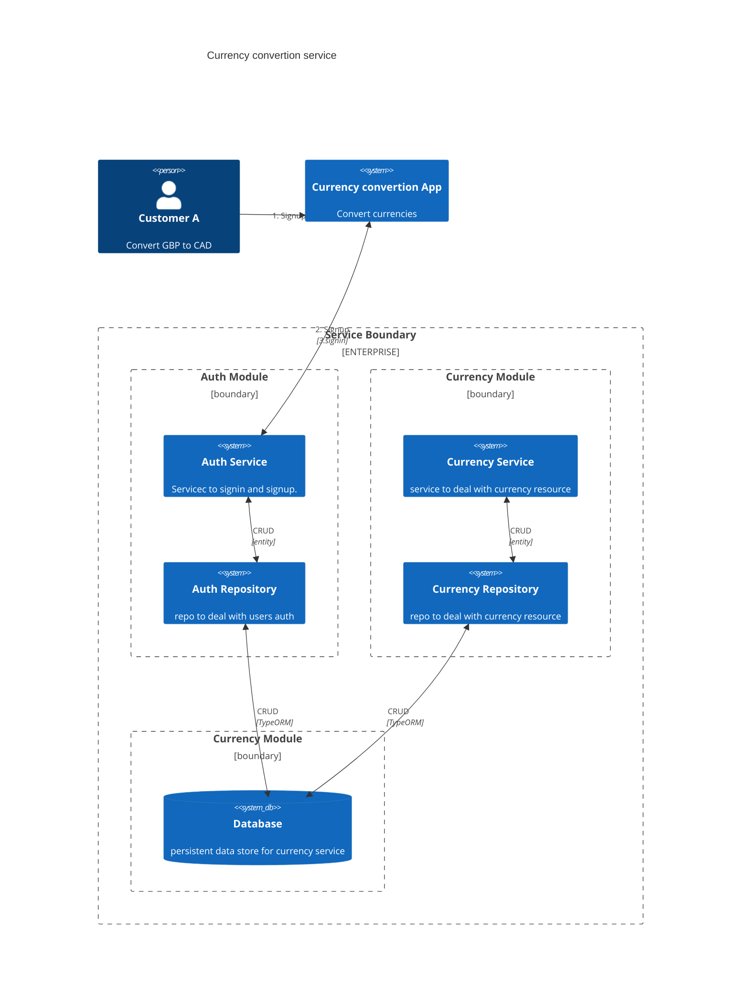

<p align="center">
  <a href="http://nestjs.com/" target="blank"></a>
</p>

[circleci-image]: https://img.shields.io/circleci/build/github/nestjs/nest/master?token=abc123def456
[circleci-url]: https://circleci.com/gh/nestjs/nest

  <p align="center">A progressive, efficient and scalable server-side <a href="http://nodejs.org" target="_blank">Node.js</a> framework application for currency exchange service.</p>
    <p align="center">
<a href="https://www.npmjs.com/~nestjscore" target="_blank"></a>
<a href="https://www.npmjs.com/~nestjscore" target="_blank"></a>
<a href="https://www.npmjs.com/~nestjscore" target="_blank"></a>
<a href="https://circleci.com/gh/nestjs/nest" target="_blank"></a>
<a href="https://coveralls.io/github/nestjs/nest?branch=master" target="_blank"></a>
<a href="https://discord.gg/G7Qnnhy" target="_blank"></a>
<a href="https://opencollective.com/nest#backer" target="_blank"></a>
<a href="https://opencollective.com/nest#sponsor" target="_blank"></a>
  <a href="https://paypal.me/kamilmysliwiec" target="_blank"></a>
    <a href="https://opencollective.com/nest#sponsor"  target="_blank"></a>
  <a href="https://twitter.com/nestframework" target="_blank"></a>
</p>
  <!--[](https://opencollective.com/nest#backer)
  [](https://opencollective.com/nest#sponsor)-->

## Description

Currency exchange service

### Objective

Using Node and any framework, your task is to build a currency conversion service that includes FIAT and cryptocurrencies.

### Brief

In this challenge, your assignment is to build a service that makes conversions between different currencies. You will connect to an external API to request currency data, log & store requests of your users, and rate limit requests based on specific criteria. Your service must support at least the following currency pairs:

USD
EUR
BTC
ETH

### Tasks

- Implement assignment using:

  - Language: **Node**
  - Framework: **any framework**

- We recommend using the Coinbase API for exchange rates:

  https://developers.coinbase.com/api/v2#get-exchange-rates

- Your service should be able to identify users. You may use any form of authentication that you think is suitable for the task (e.g., API keys, Username/Password)
  - Your service needs to store each request, the date/time it was performed, its parameters and the response body
- Each user may perform 100 requests per workday (Monday-Friday) and 200 requests per day on weekends. After the quota is used up, you need to return an error message
- The service must accept the following parameters:
  - The source currency, the amount to be converted, and the final currency
  - e.g. `?from=BTC&to=USD&amount=999.20`
- Your service must return JSON in a structure you deem fit for the task
- BONUS: find a clever strategy to cache responses from the external currency API

### Evaluation Criteria

- **Node** best practices
- Show us your work through your commit history
- We're looking for you to produce working code, with enough room to demonstrate how to structure components in a small program
- Completeness: Did you complete the features?
- Correctness: Does the functionality act in sensible, thought-out ways?
- Maintainability: Is it written in a clean, maintainable way?
- Testing: Is the system adequately tested?

### CodeSubmit

Please organize, design, test, and document your code as if it were going into production - then push your changes to the master branch. After you have pushed your code, you may submit the assignment on the assignment page.

###Design

#### Resources

- User
- Currency

#### Diagram



#### Routes

- Create a new user
  `POST /auth/signup {email, password}`

- Sign in as existing user
  `POST /auth/signin {email, password}`

- Convert one currency to another
  `GET /currency/converter?:from/:to/:amount`

#### Pending Tasks - TODO

- Prod configuration - DB sync off
- Log rotation
- Optimize logs
- add more test cases

## Installation

```bash
$ yarn
```

## Running the app

```bash
# development
$ yarn start

# watch mode
$ yarn start:dev

# production mode
$ yarn start:prod
```

## Test

```bash
# unit tests
$ yarn test

# e2e tests
$ yarn test:e2e

# test coverage
$ yarn test:cov
```

## Stay in touch

- Author - [Ravinder Cheema](https://www.linkedin.com/in/getravindercheema/)
